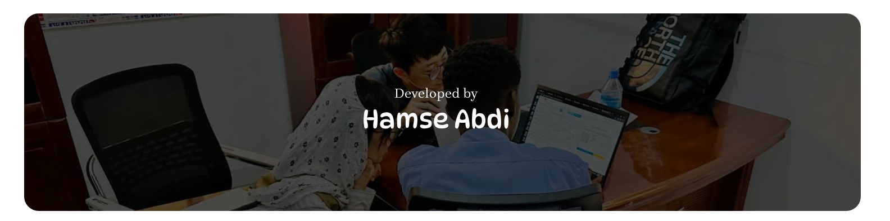

# 🌐 Hamse Abdi — Developer Portfolio

This is a personal developer portfolio website built to showcase Hamse Abdi’s background, technical skills, key projects, and career achievements. It provides a clean and professional digital presence where potential clients, collaborators, or employers can learn more about the developer and get in touch easily.

## 🔍 Overview

The portfolio is fully responsive, modern, and lightweight — designed for fast loading and clear presentation of content. It highlights Hamse’s work across health systems, school management platforms, and various custom applications.

## 🚀 Features

- ✅ Responsive design (mobile-first)
- ✅ Clean and minimal UI with Bootstrap 4
- ✅ Project showcase section
- ✅ About Me section
- ✅ Contact form (HTML-ready)
- ✅ GitHub and LinkedIn links
- ✅ Simple to customize and deploy

## 🛠 Tech Stack

| Tool/Library     | Purpose                    |
|------------------|-----------------------------|
| HTML5            | Markup structure             |
| CSS3             | Styling                      |
| Bootstrap 4      | Layout and responsiveness    |
| JavaScript       | Interactivity (light use)    |
| GitHub Pages     | Hosting                      |

## 🖼️ Screenshots


> _(Screenshoots)_

## 📂 Project Structure

```
portfolio/
├── index.html
├── css/
│   └── style.css
├── js/
│   └── main.js
└── assets/
    └── img/
```

## 🎨 Ui Preview Design (Figna)

The initial user interface design was created in Figma before the development phase. You can explore the full design and layout here:
👉 Figma Design Link :- https://www.figma.com/design/GC3tqgziRT7fiJ838ScTWS/Untitled?node-id=0-1&p=f&t=kyciNUq4JDLO8okT-0

<br>

## 📦 Getting Started

To run this locally:

1. Clone the repository:

   ```bash
   git clone https://github.com/hamsesulup/portfolio.git
   cd portfolio


No build tools or back-end required.

## 🌐 Live Demo

<<<<<<< HEAD
- ✅ About Your Self
- ✅ What you have been done before (Your work experience)
- ✅ Your Skills 
- ✅ Project you have done
- ✅ Review
- ✅ Project Detail
- ✅ Whatapp chat
- ✅ Email contact
=======
Check out the live version here:
👉 https://hamsesulup.github.io/Portfolio-Website/
>>>>>>> dec8dd55b696d2b06c704f0d40268376c322627e


## 📬 Contact

- GitHub: @hamsesulup
- LinkedIn: https://linkedin.com/hamsesulup
- Email: hamsesulup@gmail.com

## 📝 License
This project is open-source and available under the MIT License.

##



